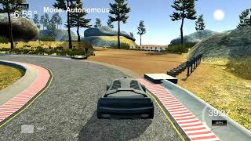
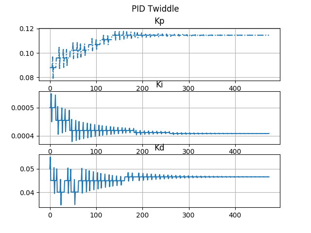

# CarND-Controls-PID
Self-Driving Car Engineer Nanodegree Program

## Introduction
The purpose of this project was to build a PID controller and tune the controller to drive a car on a
simulator given the cross track error (CTE) and speed of the vehicle via uws socket. Two separate controllers were used  
to provide the throttle and steer value for longitudinal and lateral control.

## Rubric

_Describe the effect each of the P, I, D components had in your implementation._

Only With Kp:
Proportional control (Kp) makes the car steer to the right if the car is on the left. It steers to the left if the car
is on the right. As long as the CTE is non-zero, steering value is non-zero. Since the car approaches the trajectory at 
a large heading angle. The car keeps oscillating about the trajectory with only Kp control as show in the video below. 

[](https://youtu.be/CTqjJojyRcU)


With Kp and Kd:
Kd damps the controls. As the cte starts reducing, this compensates the steering angle so that the car can approach 
the trajectory smoothly with a small heading angle to the trajectory. This almost makes the control perfect enough.

[](https://youtu.be/_SQNph693kM)


With twiddle tuned PID:

Since Kp and Kd does not make the car stay on the trajectory over a long time. A small amount of Ki is added to bring
 the back to the center. The car stays at the center as shown in the video below:

[](https://youtu.be/736S8ZEYA3U)


_Describe how the final hyperparameters were chosen._

A proportional controller was used for longitudinal control to slow down the at sharp turns where CTE was high. A maximum
throttle of 0.4 seemed optimal for this case. 

Twiddle method was used for tuning the PID algorithm. The logs are shown in tuningLog file. Initially the car was tuned 
manually to keep the car in the trajectory manually. Later Twiddle tuning was done to check the sensitivity and cost for 
each change. If the change is more optimal then the change is incorporated into the system for the next iteration. For 
each iteration the car went through the entire loop.


Sample log is shown below for illustration:

_new parameters<br>
 P: 0.088, I: 0.0005, D: 0.055<br>
 step: 4800<br>
 total error: 1470.24<br>
 best error: 1093.24<br>
 new parameters<br>
 P: 0.088, I: 0.0005, D: 0.045<br>
 step: 6400<br>
 total error: 920.065<br>
 best error: 1093.24<br>
 improvement!<br>
 new parameters<br>
 P: 0.088, I: 0.00055, D: 0.045<br>_
 
## Original Question ReadMe

## Dependencies

* cmake >= 3.5
 * All OSes: [click here for installation instructions](https://cmake.org/install/)
* make >= 4.1(mac, linux), 3.81(Windows)
  * Linux: make is installed by default on most Linux distros
  * Mac: [install Xcode command line tools to get make](https://developer.apple.com/xcode/features/)
  * Windows: [Click here for installation instructions](http://gnuwin32.sourceforge.net/packages/make.htm)
* gcc/g++ >= 5.4
  * Linux: gcc / g++ is installed by default on most Linux distros
  * Mac: same deal as make - [install Xcode command line tools]((https://developer.apple.com/xcode/features/)
  * Windows: recommend using [MinGW](http://www.mingw.org/)
* [uWebSockets](https://github.com/uWebSockets/uWebSockets)
  * Run either `./install-mac.sh` or `./install-ubuntu.sh`.
  * If you install from source, checkout to commit `e94b6e1`, i.e.
    ```
    git clone https://github.com/uWebSockets/uWebSockets 
    cd uWebSockets
    git checkout e94b6e1
    ```
    Some function signatures have changed in v0.14.x. See [this PR](https://github.com/udacity/CarND-MPC-Project/pull/3) for more details.
* Simulator. You can download these from the [project intro page](https://github.com/udacity/self-driving-car-sim/releases) in the classroom.

Fellow students have put together a guide to Windows set-up for the project [here](https://s3-us-west-1.amazonaws.com/udacity-selfdrivingcar/files/Kidnapped_Vehicle_Windows_Setup.pdf) if the environment you have set up for the Sensor Fusion projects does not work for this project. There's also an experimental patch for windows in this [PR](https://github.com/udacity/CarND-PID-Control-Project/pull/3).

## Basic Build Instructions

1. Clone this repo.
2. Make a build directory: `mkdir build && cd build`
3. Compile: `cmake .. && make`
4. Run it: `./pid`. 

Tips for setting up your environment can be found [here](https://classroom.udacity.com/nanodegrees/nd013/parts/40f38239-66b6-46ec-ae68-03afd8a601c8/modules/0949fca6-b379-42af-a919-ee50aa304e6a/lessons/f758c44c-5e40-4e01-93b5-1a82aa4e044f/concepts/23d376c7-0195-4276-bdf0-e02f1f3c665d)

## Editor Settings

We've purposefully kept editor configuration files out of this repo in order to
keep it as simple and environment agnostic as possible. However, we recommend
using the following settings:

* indent using spaces
* set tab width to 2 spaces (keeps the matrices in source code aligned)

## Code Style

Please (do your best to) stick to [Google's C++ style guide](https://google.github.io/styleguide/cppguide.html).

## Project Instructions and Rubric

Note: regardless of the changes you make, your project must be buildable using
cmake and make!

More information is only accessible by people who are already enrolled in Term 2
of CarND. If you are enrolled, see [the project page](https://classroom.udacity.com/nanodegrees/nd013/parts/40f38239-66b6-46ec-ae68-03afd8a601c8/modules/f1820894-8322-4bb3-81aa-b26b3c6dcbaf/lessons/e8235395-22dd-4b87-88e0-d108c5e5bbf4/concepts/6a4d8d42-6a04-4aa6-b284-1697c0fd6562)
for instructions and the project rubric.

## Hints!

* You don't have to follow this directory structure, but if you do, your work
  will span all of the .cpp files here. Keep an eye out for TODOs.

## Call for IDE Profiles Pull Requests

Help your fellow students!

We decided to create Makefiles with cmake to keep this project as platform
agnostic as possible. Similarly, we omitted IDE profiles in order to we ensure
that students don't feel pressured to use one IDE or another.

However! I'd love to help people get up and running with their IDEs of choice.
If you've created a profile for an IDE that you think other students would
appreciate, we'd love to have you add the requisite profile files and
instructions to ide_profiles/. For example if you wanted to add a VS Code
profile, you'd add:

* /ide_profiles/vscode/.vscode
* /ide_profiles/vscode/README.md

The README should explain what the profile does, how to take advantage of it,
and how to install it.

Frankly, I've never been involved in a project with multiple IDE profiles
before. I believe the best way to handle this would be to keep them out of the
repo root to avoid clutter. My expectation is that most profiles will include
instructions to copy files to a new location to get picked up by the IDE, but
that's just a guess.

One last note here: regardless of the IDE used, every submitted project must
still be compilable with cmake and make./

## How to write a README
A well written README file can enhance your project and portfolio.  Develop your abilities to create professional README files by completing [this free course](https://www.udacity.com/course/writing-readmes--ud777).

